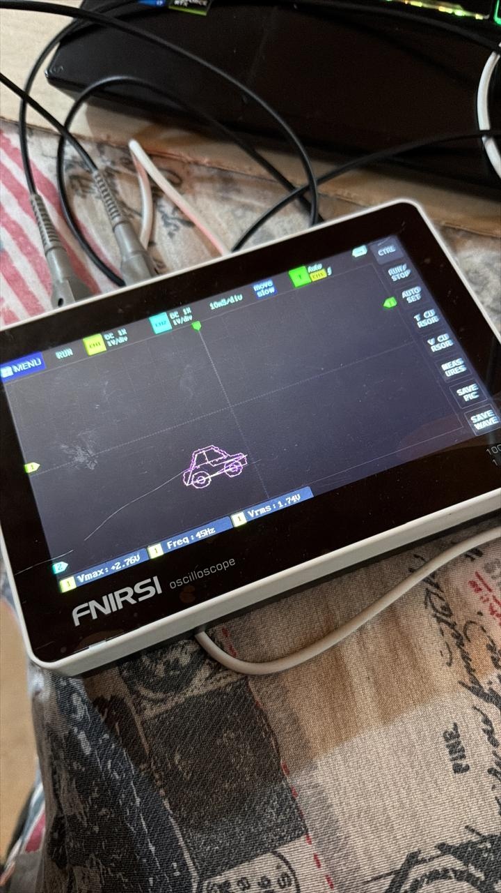

# Dibujo XY con el DAC del ESP32 — "Carro de Lissajous"

Proyecto que usa los **dos canales DAC del ESP32** para dibujar la figura de un carro directamente en la pantalla de un **osciloscopio en modo XY**, sin necesidad de ninguna placa de video ni pantalla adicional: el osciloscopio actúa como "pantalla", trazando el punto según el voltaje que llega a cada canal.

📸 Resultado real, mostrado en un osciloscopio FNIRSI:



---

## Tabla de contenido

1. [Nota técnica: ¿Lissajous o dibujo vectorial XY?](#nota-técnica-lissajous-o-dibujo-vectorial-xy)
2. [Cómo funciona](#cómo-funciona)
3. [Hardware utilizado](#hardware-utilizado)
4. [Estructura del repositorio](#estructura-del-repositorio)
5. [Cómo probarlo](#cómo-probarlo)
6. [Simulación en el navegador](#simulación-en-el-navegador)
7. [Posibles mejoras](#posibles-mejoras)

---

## Nota técnica: ¿Lissajous o dibujo vectorial XY?

Este proyecto suele llamarse coloquialmente "figura de Lissajous", pero vale la pena precisar la diferencia:

- Una **figura de Lissajous** clásica se genera alimentando cada canal del osciloscopio (X y Y) con una **señal senoidal** de frecuencia distinta; el patrón resultante depende de la relación entre esas frecuencias.
- Lo que hace este proyecto es distinto: usa el **DAC del ESP32** para escribir, punto por punto, coordenadas (X, Y) calculadas explícitamente para trazar la silueta de un carro (líneas rectas y círculos), aprovechando que el osciloscopio en **modo XY** dibuja el punto (voltaje CH1, voltaje CH2) en cada instante.

Es decir: técnicamente es **"arte de osciloscopio" o dibujo vectorial en modo XY**, no una Lissajous en sentido estricto. Se conserva el nombre familiar del proyecto por contexto académico, pero esta distinción es importante si te preguntan por el fundamento teórico.

---

## Cómo funciona

1. El ESP32 tiene **2 canales DAC de 8 bits** (0–255), disponibles en **GPIO25** y **GPIO26**, capaces de generar un voltaje analógico real entre 0 y 3.3 V.
2. El código genera las coordenadas (x, y) de cada trazo del carro (líneas y círculos para las ruedas) usando funciones auxiliares (`linea()`, `circulo()`, `rueda()`).
3. Cada punto (x, y) se invierte (`255 - x`, `255 - y`) y se escribe con `dacWrite()`:
   - `DAC_X (GPIO25)` → conectado al **canal 1 (CH1)** del osciloscopio.
   - `DAC_Y (GPIO26)` → conectado al **canal 2 (CH2)** del osciloscopio.
4. El osciloscopio, configurado en **modo XY** (en vez del modo tiempo/voltaje habitual), traza un punto en la posición (voltaje CH1, voltaje CH2) por cada par de valores recibido.
5. Como el ESP32 recorre los puntos del carro una y otra vez a alta velocidad (`loop()` continuo), el ojo humano y la persistencia de la pantalla perciben una figura completa y estable, en lugar de un punto individual moviéndose.

---

## Hardware utilizado

| Componente | Conexión |
|---|---|
| ESP32-WROOM-32 | Alimentado por USB |
| Canal DAC X | GPIO25 → punta de prueba **CH1** del osciloscopio |
| Canal DAC Y | GPIO26 → punta de prueba **CH2** del osciloscopio |
| GND del ESP32 | Conectado al GND/referencia del osciloscopio |
| Osciloscopio | Configurado en **modo XY**, escala 1 V/div (en la prueba real se usó un FNIRSI) |

> Es indispensable que el osciloscopio soporte el **modo XY** (donde el eje horizontal deja de representar tiempo y pasa a representar el voltaje del canal 1). No todos los osciloscopios básicos lo tienen.

---

## Estructura del repositorio

```
esp32-osciloscopio-carro-dac/
├── README.md
├── src/
│   └── esp32/
│       └── DIBUJO_CARRO_DAC.ino     ← código original
├── simulacion/
│   └── simulacion.html                  ← simulador visual en el navegador (sin hardware)
└── img/
    └── resultado-osciloscopio.jpeg   ← foto real del carro dibujado en el osciloscopio
```

---

## Cómo probarlo

1. Carga `src/esp32/DIBUJO_CARRO_DAC.ino` al ESP32 desde el Arduino IDE (placa: **ESP32 Dev Module**).
2. Conecta la punta del **CH1** del osciloscopio a **GPIO25**, y la del **CH2** a **GPIO26**. Conecta también el GND del osciloscopio al GND del ESP32.
3. En el osciloscopio, cambia el modo de visualización de **tiempo/voltaje (Y-T)** a **XY**.
4. Ajusta la escala a **1 V/div** en ambos canales (el DAC del ESP32 trabaja en un rango de 0–3.3 V).
5. Deberías ver la figura del carro trazándose en pantalla de forma continua.

Si el dibujo se ve inestable o parpadea demasiado, ajusta la constante `DELAY_PUNTO` en el código (auméntala para un trazo más lento y estable, redúcela para un trazo más rápido).

---

## Simulación en el navegador

Como no todos tienen un osciloscopio físico a la mano, el repositorio incluye [`simulacion/simulacion.html`](simulacion/preview.html): una página web independiente que reproduce visualmente el mismo recorrido de puntos que el ESP32 enviaría al osciloscopio, dibujando el carro sobre una retícula estilo osciloscopio (con controles de pausa y limpieza).

Para usarla, simplemente abre el archivo `preview.html` en cualquier navegador — no requiere instalar nada ni tener el ESP32 conectado.

> Esta simulación es solo una ayuda visual para entender el proyecto sin hardware; el comportamiento real en el osciloscopio (brillo, persistencia, ruido de la señal) puede lucir distinto, como se aprecia en la foto de la sección anterior.

---

## Posibles mejoras

- Agregar más figuras (seleccionables por un botón o comando serie) además del carro.
- Sincronizar el dibujo con una señal de reloj externa para lograr un trazo más estable a mayor velocidad.
- Migrar el ejemplo también a MicroPython, usando `machine.DAC`, para mantener consistencia con el resto del portafolio.
- Aumentar la resolución percibida usando interpolación adicional entre puntos muy separados.
